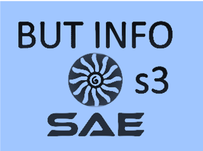
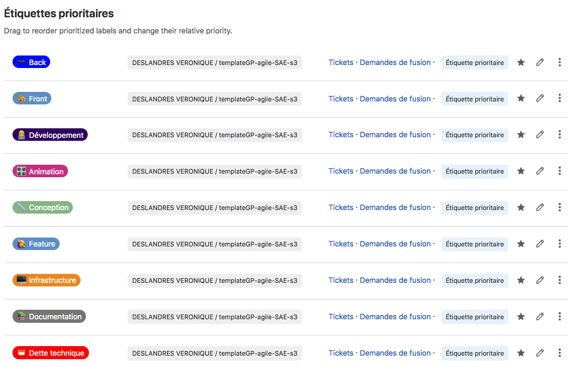
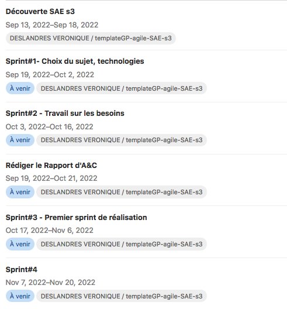
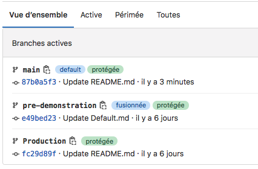
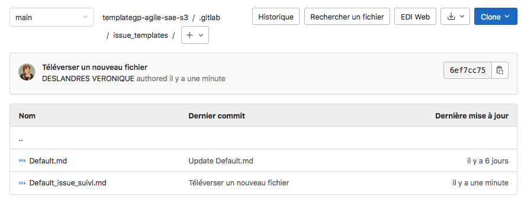
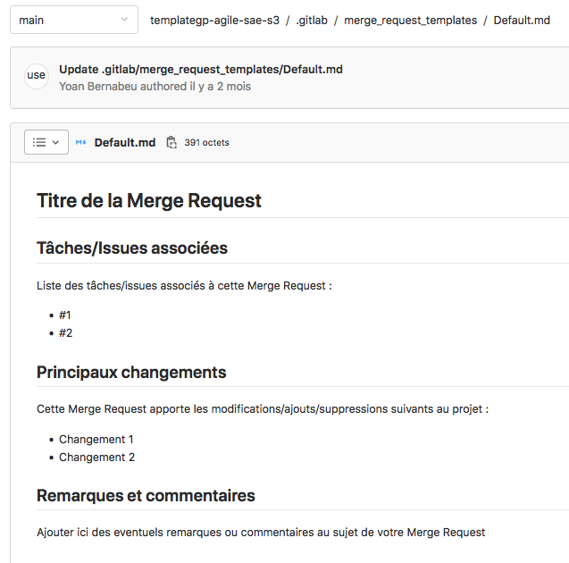

# templategp-agile-sae-s3

Template de base pour gérer (en mode SCRUM-light) les SAE du s3 avec GitLab 🦊

##  1.  Table des matières
<!-- vscode-markdown-toc -->
* 1. [ Table des matières](#Tabledesmatires)
* 2. [Pourquoi ce dépôt ?](#Pourquoicedpt)
* 3. [Que propose ce dépôt ?](#Queproposecedpt)
	* 3.1. [Les labels](#Leslabels)
	* 3.2. [Les Jalons](#Lesjalons)
	* 3.3. [Le Board](#LeBoard)
	* 3.4. [Les branches](#Lesbranches)
	* 3.5. [Modèles pour les issues et les merges requests](#Modlespourlesissuesetlesmergesrequests)
* 4. [Comment utiliser ce dépôt ?](#Commentutilisercedpt)
* 5. [Licence](#Licence)
* 6. [Auteur](#Auteur)

<!-- vscode-markdown-toc-config
	numbering=true
	autoSave=true
	/vscode-markdown-toc-config -->
<!-- /vscode-markdown-toc -->

##  2. Pourquoi ce dépôt ?

Ce dépot à pour objectif de fournir un outil de démarrage rapide pour organiser et gérer de façon agile un nouveau projet avec GitLab, notamment pour la SAE du s3.

Partant du constat que le démarrage d'un projet est un processus long et complexe, on fournit ici un outil simple pour lancer un projet avec GitLab, que vous pourrez réutiiser et adapter au fil du temps avec votre propre affinité de GiLab.

##  3. Que propose ce dépôt ?

Ce dépôt fournit un ensemble de modèles, de fichiers et de paramétrages pour vous faciliter le démarrage d'un projet avec GitLab, que vous pouvez modifier à volonté.
Vous trouverez les éléments suivants :

-   Ce fichier README.md
-   Des modèles pour les issues et les merge requests, et un modèle pour la réunion en séance avec le tuteur-SAE 
-   Une collection de labels
-   Une liste de jalons (_milestones_) correspondant aux dates des séances de SAE avec le tuteur
-   Un modèle de Board
-   3 Branches spécifiques à la SAE :
    -   Main
    -   Pré-Démonstration
    -   Démonstration

(Dans un cadre professionnel, ces 2 dernières branches s'appellent _pré-production_ et _production_)

###  3.1. Les labels

Les labels sont des éléments qui sont associés à des _issues_ et _merge requests_ : ils permettent de les classer, les organiser et les identifier simplement. Voici ceux qu'on propose ici, vous pouvez en supprimer ou ajouter d'autres.

On a distingué les labels prioritaires :

Des labels utilisés pour le board :

###  3.2. Les Jalons

Les jalons (milestones) sont les échéances connues du projet, qu'il faut préparer ou pour lesquelles certaines tâches / livrables doivent être terminées.
Dans le modèle, on a défini des jalons qui devraient vous aider, notamment pour préparer chaque séance de SAE avec le tuteur.

Libre à vous de les adapter.

###  3.3. Le Board

Le Board est l'outil central de GitLab pour organiser et gérer les tâches afférentes au projet.

Il permet de les visualiser et de suivre leur progression.

La structure de ce board adopte l'approche [Scrumban](https://asana.com/fr/resources/scrumban).

###  3.4. Les branches

Les trois branches proposées dans ce template permettent de gérer de manière simple l'état du votre projet, jusqu'à la revue finale de projet devant un jury de 2 enseignants.

Ce modèle est librement inspiré de l'approche GitLab Flow, pour en savoir plus : [GitLab Flow](https://www.youtube.com/watch?v=ZJuUz5jWb44).

###  3.5. Modèles pour les issues et les merges requests

Ce template propose des modèles pour les _issues_ et les _merge requests_ afin de simplifier et standardiser leur utilisation par les équipes du projet.

##  4. Comment utiliser ce dépôt ?

> Vous utilisez ce dépôt comme **base d'inspiration** pour votre gérer votre projet simplement en adaptant les éléments à votre contexte.

> **Vous pouvez également télécharger l'export du dépôt pour l'importer avec tous les éléments dèja présents (labels, issues, merges requests, board, branches, ...)**
> 1. [Télécharger l'export du dépôt](.ressources/export.tar.gz)
> 2. [Importer l'export dans GitLab](https://docs.gitlab.com/ee/user/project/settings/import_export.html#import-a-project-and-its-data)

##  5. Licence

Ce dépôt est sous licence [MIT](LICENSE)

##  6. Auteur
Contact : @V.Deslandres
Ce travail est basé sur le kit starter de projet de [YoanDev](https://yoandev.co)
